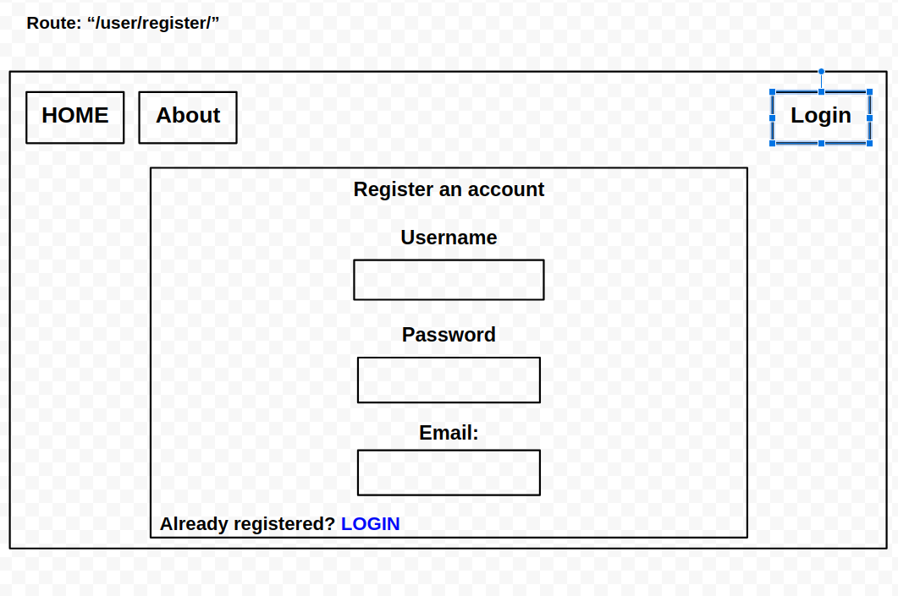

# Bull&Bear

## Team: 
[Adam Owada](https://github.com/adamowada)  
[Chuck Li](https://github.com/ticochuck)  
[Natalie Sinner](https://github.com/nsinner1)  
[Roman Sydoruk](https://github.com/sydoruk89)  
[Thomas Sherer](https://github.com/vorSherer) 

## Description
Users and investors want a smarter way to get stock information and stock news.
User would be able to add stocks to a watch list, that way the user would only receive information they care about.

## Wire Frames

## User Stories
User Story text can be viewed [here](user_stories.md)

## Software Requirements
https://github.com/night-traders/bull-bear/blob/main/requirements.md

## Domain Modeling
https://docs.google.com/drawings/d/1xuvEmNHJiQMPj4maDiDIR4pzicX3fjAEIxR8bpRGkIY/edit

## Database
This app will be using PostgreSQL database.