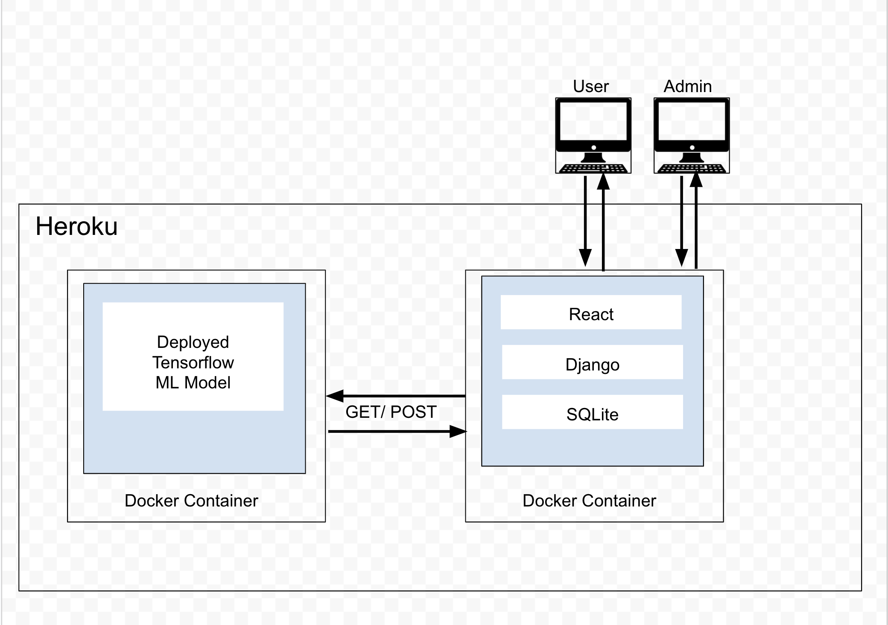

# Software Requirements
## Vision

Users and investors want a smarter 
way to get stock information and stock news. Once log in, a user has possibility to add stocks to a watchlist and get news about it.

## Scope (In/Out)
* __IN SCOPE__:  
- The web app will provide information to all users about stock market with an option to search news and see the stock prediction.
- The app will provide a posibility to sign up for new users.
- The app will provide a posibility to log in for existing users.
- Once user login in The app will be able to search stocks and add it to a watchlist   

* __OUT OF SCOPE__ - *What will your product not do*: 
My app does not attempt to convince the users to trade stocks with real money.

### Minimum Viable Product
* A Fullstack app with React frontend and Django backend and multiple users with django authentication.
* Each user has a stock watch list
* Deployed ML stock prediction model, forecasts 1 week for each stock on the watch list
* Displays most relevant news stories for stocks on watch list, as retrieved by API

### Stretch Goals
To make the app to trade with fake money.

## Functional Requirements
- An admin can create and delete user accounts
- A user can update their profile information
- Any user can see top news and search for specific stock news.  
- Any user can sign up on website.
- A registered user can add stocks to a watchlist and see related news  

### Data Flow

- When a user on the Home page, it shows top stock news (making request to 3rd party API) and the stock prediction (used ML on Django side)
- Once login in, it redirects user to account page, where he/she can search for stocks and add it to the watchlist and save it to the database.
- As a stretch goal there will be ability buy/sell stocks with fake money.

## Non-Functional Requirements
***Secutity***
* This non-functional requirement assures that all data inside the system or its part will be protected against malware attacks or unauthorized access. It can include comprehensive authorization and authentication scheme for each system actor. Also, the system is supposed to introduce constraints on who can generate, view, duplicate, edit, or delete the data.

***Performance and scalability***
* The app  can be launched on one environment or another. We did not specify operating systems, hardware devices, browsers, software systems, and their versions because we will implement Docker container. It means the app can be download and installed on a different operating systems. 